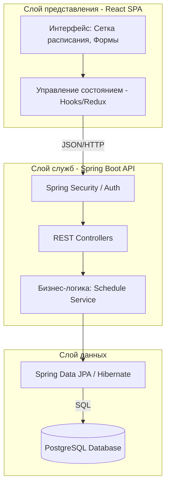
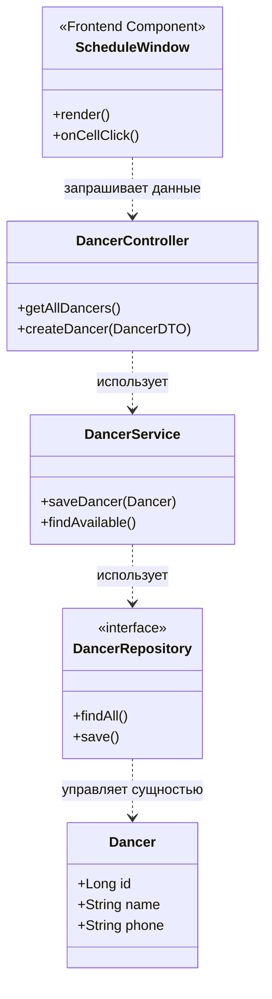

# Отчет по проектированию и анализу архитектуры: Dance Center Service

## Часть 1. Проектирование архитектуры ("To Be" — Как должно быть)

В данном разделе описана целевая архитектура системы администрирования танцевальной студии, спроектированная согласно принципам масштабируемости и надежности.

### 1. Тип приложения
**Веб-приложение (Web Application)**, реализованное как **Single Page Application (SPA)**.
*   **Frontend:** Выполняется в браузере пользователя, обеспечивая высокую интерактивность (динамическое расписание).
*   **Backend:** RESTful API, обрабатывающий бизнес-логику и запросы к данным.

### 2. Стратегия развёртывания
**Распределенное развертывание с использованием контейнеризации (Docker).**
*   **Обоснование:** Изоляция компонентов (Frontend, Backend, DB) в отдельных контейнерах гарантирует идентичность окружения на этапе разработки и эксплуатации. Позволяет легко масштабировать API-сервер при увеличении нагрузки.

### 3. Обоснование выбора технологий
*   **React 18+:** Выбран для создания сложного UI (компоненты расписания, фильтры танцоров) благодаря компонентному подходу и виртуальному DOM.
*   **Java 17 + Spring Boot:** Обеспечивает строгую типизацию, безопасность (Spring Security) и легкую интеграцию с БД через JPA.
*   **PostgreSQL 12+:** Реляционная СУБД для обеспечения целостности данных (связи между тренерами, группами и залами).
*   **Docker & Docker Compose:** Инструментарий для оркестрации и быстрого развертывания всей инфраструктуры одной командой.

### 4. Показатели качества
*   **Производительность:** Время отклика API не более 500мс для CRUD-операций.
*   **Удобство (Usability):** Обучение администратора занимает не более 2 часов благодаря интуитивному интерфейсу.
*   **Надежность:** Автоматическое восстановление контейнеров при сбоях и ежедневное резервное копирование БД.

### 5. Сквозная функциональность (Cross-cutting functionality)
*   **Безопасность:** Аутентификация на базе JWT (JSON Web Tokens) или сессий через Spring Security.
*   **Валидация:** Двухуровневая проверка данных (на клиенте для UI и на сервере для обеспечения бизнес-правил).
*   **Логирование:** Централизованное логирование действий администраторов (аудит изменений в расписании).

### 6. Структурная схема (To Be)

---

## Часть 2. Анализ архитектуры ("As Is" — Как реализовано сейчас)

На текущем этапе (Sprint 1) реализован базовый каркас серверной части и основные сущности. Анализ проведен методом обратной инженерии кода.

**Диаграмма классов серверной части (As Is):**

---

## Часть 3. Сравнение и рефакторинг

### 1. Сравнение "As Is" и "To Be"
*   **Соответствие:** Текущая реализация следует слоистой архитектуре (Controller -> Service -> Repository), что совпадает с целевой схемой.
*   **Различия:**
   *   В "As Is" отсутствует полноценный слой безопасности (Spring Security реализован не полностью).
   *   Логика валидации конфликтов в расписании (например, два занятия в одном зале в одно время) сейчас находится в зачаточном состоянии.
   *   Отсутствует контейнеризация фронтенда (запускается отдельно от бэкенда).

### 2. Анализ причин отличий
*   **Приоритеты разработки:** На первом спринте фокус был сделан на CRUD-функционале основных справочников (Танцоры, Тренеры).
*   **Сложность:** Реализация Docker-окружения для всего стека была отложена до стабилизации структуры БД.

### 3. Пути улучшения (Рефакторинг)
Для достижения целевой архитектуры "To Be" необходимо выполнить следующие шаги:

1.  **Внедрение DTO (Data Transfer Object):** Сейчас контроллеры местами работают напрямую с Entity. Необходимо полностью разделить внутренние модели данных и объекты, передаваемые по API, чтобы избежать утечки структуры БД.
2.  **Централизованная обработка исключений:** Внедрить `@ControllerAdvice` в Spring Boot для унификации ошибок, отправляемых на фронтенд (вместо стандартных 500 ошибок).
3.  **Оптимизация связи React-Spring:** Использовать Axios-интерцепторы для автоматического добавления токенов авторизации в каждый запрос.
4.  **Применение паттерна Strategy:** Для расчета стоимости абонементов (если будут разные типы скидок), чтобы не загромождать бизнес-сервисы условиями `if-else`.
5.  **Контейнеризация:** Объединить Frontend и Backend в единый `docker-compose.yaml` с использованием Nginx как Reverse Proxy.